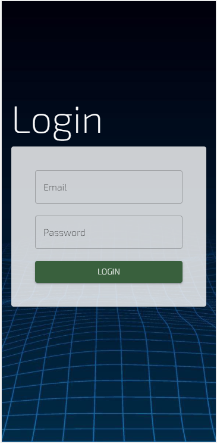

# Sara Bot

## License
  [](https://opensource.org/licenses/MIT)

## Table of Contents
[Description](#description)

[Technology](#technology)

[Usage](#usage)

[Screenshots](#screenshots)

[Contributors](#contributors)

## Description

This project features a chat function for users to interact with an AI. Through AI21's API, user is able to ask questions and receive answers in real time. 

## Technology

Our project was created utilizing the following technologies: 

* [AI21 studio](https://www.ai21.com/studio)
* [React](https://reactjs.org/)
    - [React Router Dom](https://v5.reactrouter.com/web/guides/quick-start)
    - [React Dom](https://reactjs.org/docs/react-dom.html)
* [TypeScript](https://www.typescriptlang.org/)
* [Material UI](https://mui.com/)
* [JWT](https://jwt.io/)
* [ES-Lint](https://eslint.org/)
* [Yarn](https://yarnpkg.com/)
* [NPM](https://www.npmjs.com/)

## Usage
This application is currently deployed on Heroku! 
Check us out [HERE]()

```
User Manual: 
    1. You will be required to create an account. 
    2. Log-in once you have signed up. 
    3. Once you're logged in you will be redirected to the chat page. 
    4. You may start asking questions by typing in the input box. 
    5. Your messages will be saved so you can pick up where you left off.  
    6. You can delete your chat history by accessing the options modal. 

Begin your learning today! Talk to SaraBot!
```

## Screenshots



## Contributors

Meet the Devs: 

* Travis: Front End [GitHub](https://github.com/Travis-Anderson023)
* Ryan: Back End [GitHub](https://github.com/moonryc)
* Joe: [GitHub](https://github.com/jollypong)